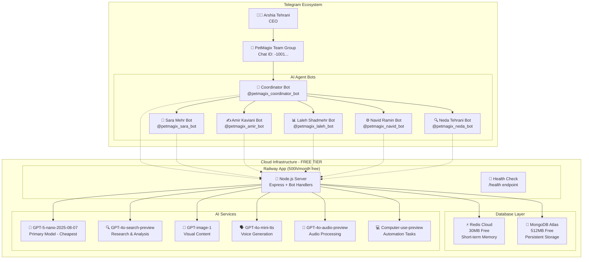
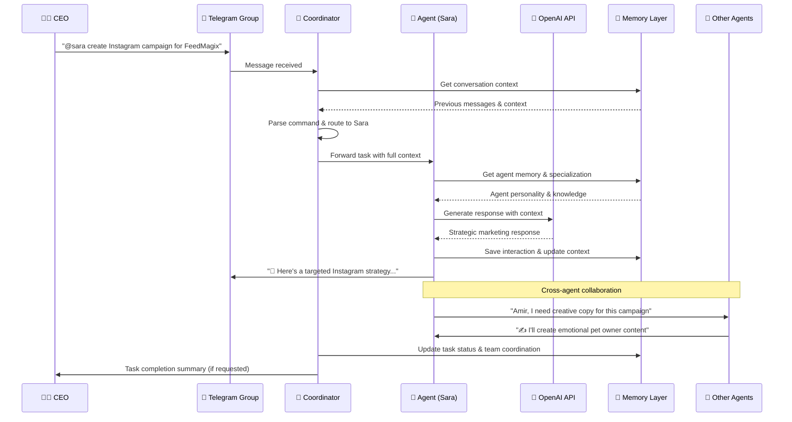
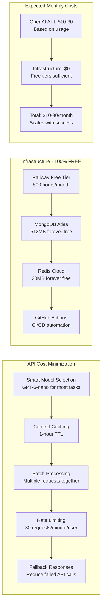
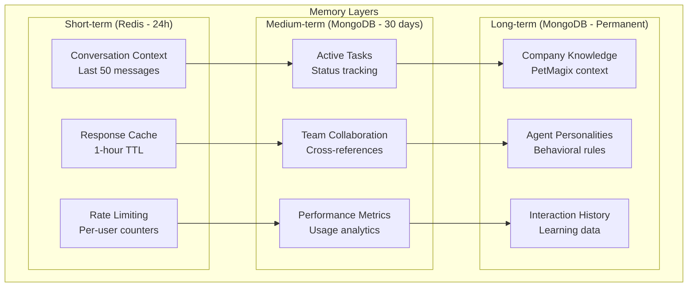
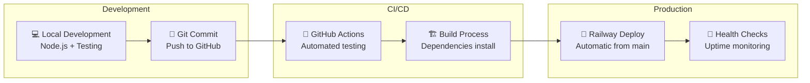
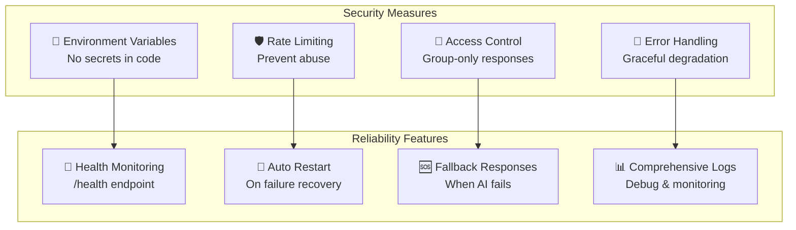

# 🏗️ PetMagix AI Agents - Complete Architecture & Deployment Plan

## System Architecture Overview

## Message Flow & Routing Protocol

## Cost Optimization Strategy

## Agent Specialization Matrix

```mermaid
graph TB
    subgraph "Marketing & Growth"
        SARA[🎯 Sara Mehr<br/>Marketing Strategist]
        SARA --> TOOLS1[GPT-5-nano + Search + Image]
        SARA --> SPEC1[Persian Market Targeting<br/>Instagram Growth<br/>Campaign Strategy]
    end

    subgraph "Content Creation"
        AMIR[✍️ Amir Kaviani<br/>Creative Copywriter]
        AMIR --> TOOLS2[GPT-5-nano + Image + TTS]
        AMIR --> SPEC2[Emotional Storytelling<br/>Persian Copy<br/>Landing Pages]
    end

    subgraph "Data & Analytics"
        LALEH[📊 Laleh Shadmehr<br/>Analytics Specialist]
        LALEH --> TOOLS3[GPT-5-nano + Search + Computer]
        LALEH --> SPEC3[Performance Analysis<br/>Conversion Tracking<br/>ROI Measurement]
    end

    subgraph "Operations"
        NAVID[⚙️ Navid Ramin<br/>COO]
        NAVID --> TOOLS4[GPT-5-nano + Computer]
        NAVID --> SPEC4[Sprint Planning<br/>Micro-SaaS Coordination<br/>Team Management]
    end

    subgraph "Research"
        NEDA[🔍 Neda Tehrani<br/>Market Analyst]
        NEDA --> TOOLS5[GPT-4o-search + GPT-5-nano]
        NEDA --> SPEC5[Pet Industry Trends<br/>Competitive Analysis<br/>Opportunity Discovery]
    end
```

## Memory & Context Architecture

## Deployment Pipeline

## Security & Reliability

## Scaling Roadmap

### Phase 1: MVP Launch (Current)
- ✅ 6 AI agents with core personalities
- ✅ Free tier infrastructure (Railway + MongoDB + Redis)
- ✅ Basic memory and task routing
- ✅ PetMagix context integration
- **Target**: Validate concept, gather feedback
- **Cost**: $10-30/month (OpenAI only)

### Phase 2: Growth Optimization (Month 2-3)
- 🔄 Enhanced agent capabilities and tools
- 🔄 Advanced analytics and reporting
- 🔄 Instagram API integration
- 🔄 Custom workflow automation
- **Target**: 100+ daily interactions
- **Cost**: $30-100/month

### Phase 3: Enterprise Features (Month 4-6)
- 🔄 Multi-language expansion
- 🔄 Custom agent training on PetMagix data
- 🔄 Advanced integrations (CRM, analytics)
- 🔄 White-label capabilities
- **Target**: 1000+ daily interactions
- **Cost**: $100-500/month

## Success Metrics & KPIs

### Technical Metrics
- **Response Time**: < 3 seconds average
- **Uptime**: > 99.5% availability
- **API Efficiency**: < $0.10 per interaction
- **Memory Usage**: < 80% of allocated resources

### Business Metrics
- **Task Completion Rate**: > 95%
- **User Satisfaction**: Measured via feedback
- **Cost per Value**: ROI on AI assistance
- **Team Productivity**: Tasks automated vs manual

### Growth Indicators
- **Daily Active Interactions**: Trending upward
- **Agent Utilization**: Balanced workload
- **Feature Adoption**: New capabilities usage
- **Feedback Quality**: Positive sentiment analysis

---

## 🚀 Ready for Launch!

This architecture provides:
- **Scalable foundation** that grows with your business
- **Cost-effective operation** using free tiers initially
- **Professional AI team** with specialized expertise
- **Robust reliability** with monitoring and fallbacks
- **Clear upgrade path** as you scale

Your PetMagix AI team is ready to help launch FeedMagix and grow your pet care empire! 🐾