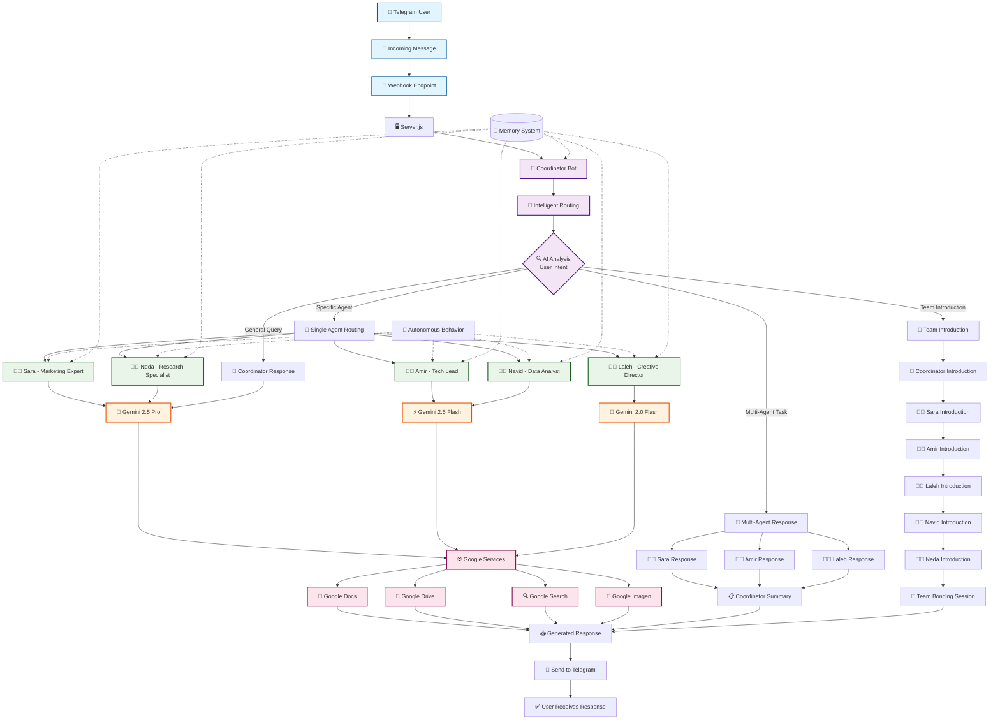
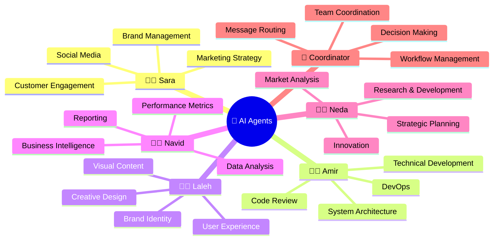
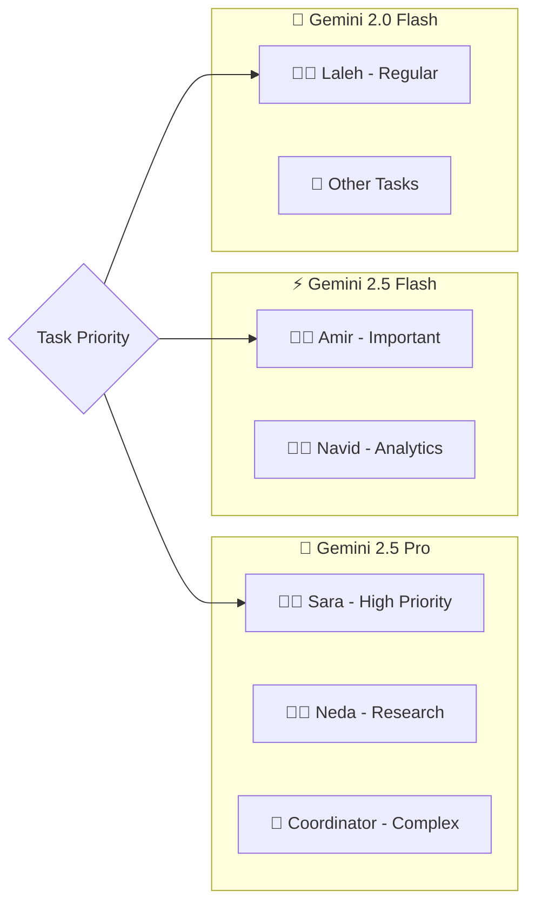
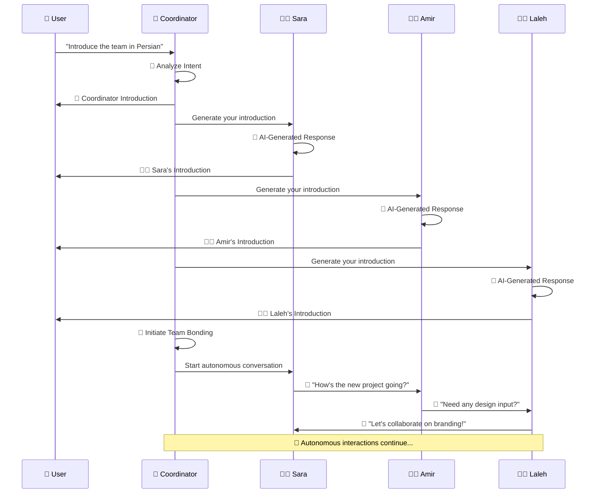
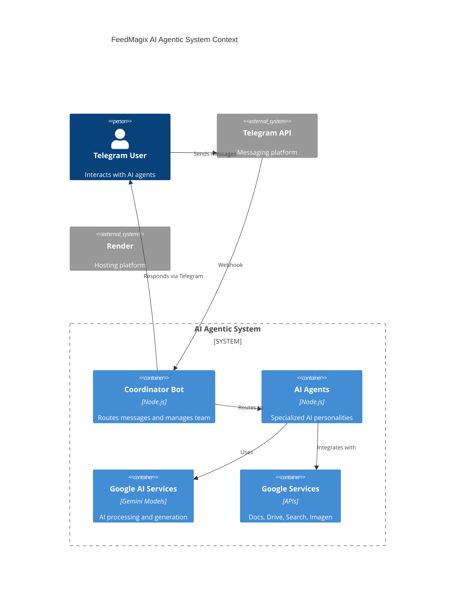

# 🤖 FeedMagix AI Agentic Workflow - Mermaid Diagram

## Complete System Architecture Flow

## Agent Specializations & Capabilities

## Google AI Model Distribution

## Autonomous Behavior Flow

## System Architecture Overview

---

## 🎯 Key Features Highlighted:

1. **🧠 Intelligent Routing**: AI-driven message analysis and routing
2. **🤖 Autonomous Agents**: Self-generating responses and interactions
3. **🤝 Team Collaboration**: Multi-agent responses and team bonding
4. **🚀 Latest AI Models**: Gemini 2.0/2.5 Flash and Pro
5. **🌐 Google Integration**: Full Google services ecosystem
6. **📱 Telegram Interface**: Seamless user interaction
7. **🔄 Auto-Deployment**: GitHub Actions to Render

---

*This diagram represents the complete agentic workflow of your AI system, showing how intelligent routing, autonomous behavior, and team collaboration work together to create a living, breathing AI office environment.*