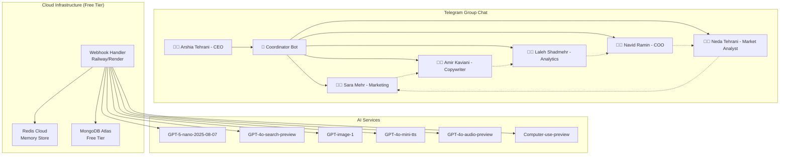
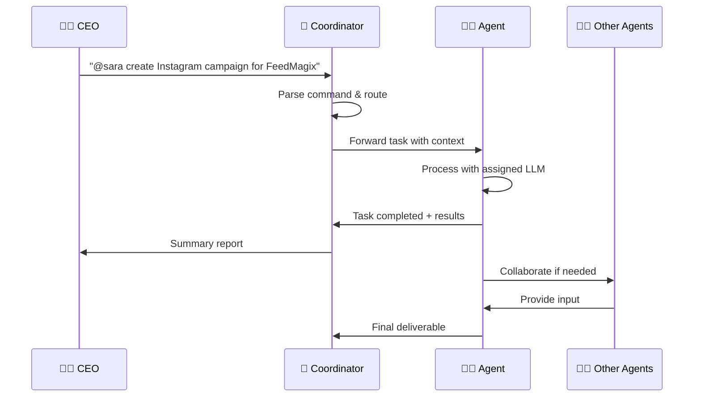
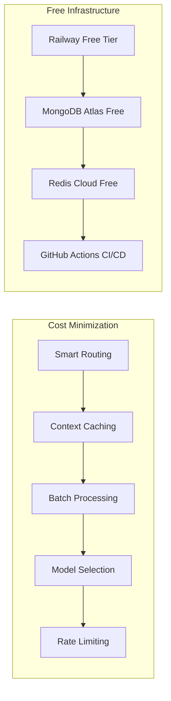
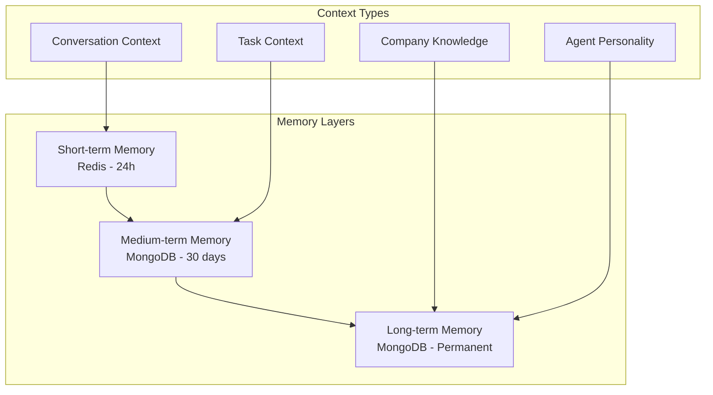

# 🤖 PetMagix Telegram Multi-Agent System Architecture

## System Overview

## Communication Flow

## Cost Optimization Strategy

## Agent Personality Matrix

| Agent | Primary LLM | Personality | Language Preference | Specialization |
|-------|-------------|-------------|-------------------|----------------|
| Sara | GPT-5-nano | Strategic, Creative | Persian/English | Marketing Strategy |
| Amir | GPT-5-nano + TTS | Emotional, Storyteller | Persian | Creative Copy |
| Laleh | GPT-5-nano + Computer | Analytical, Precise | English | Data Analysis |
| Navid | GPT-5-nano + Computer | Organized, Efficient | Persian/English | Operations |
| Neda | GPT-4o-search | Insightful, Research-focused | Persian/English | Market Research |

## Memory & Context System

